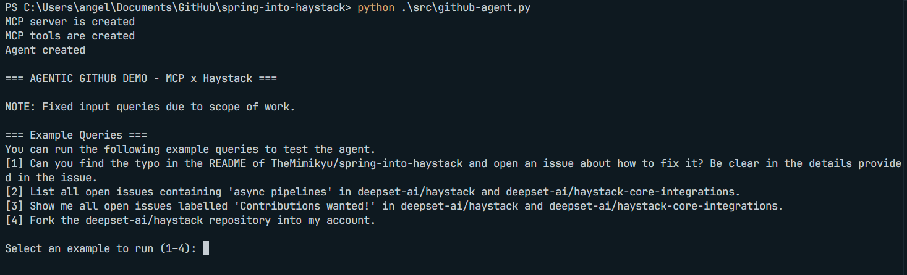
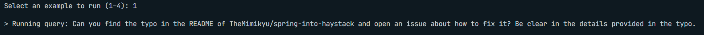
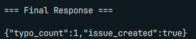
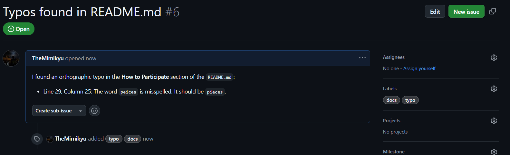
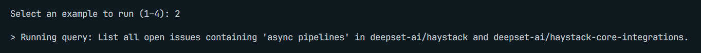
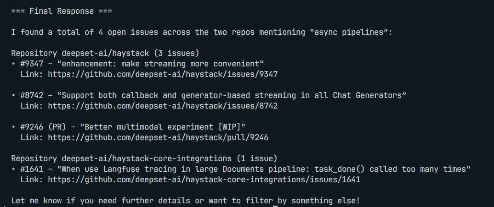
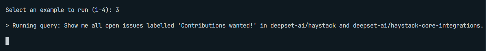
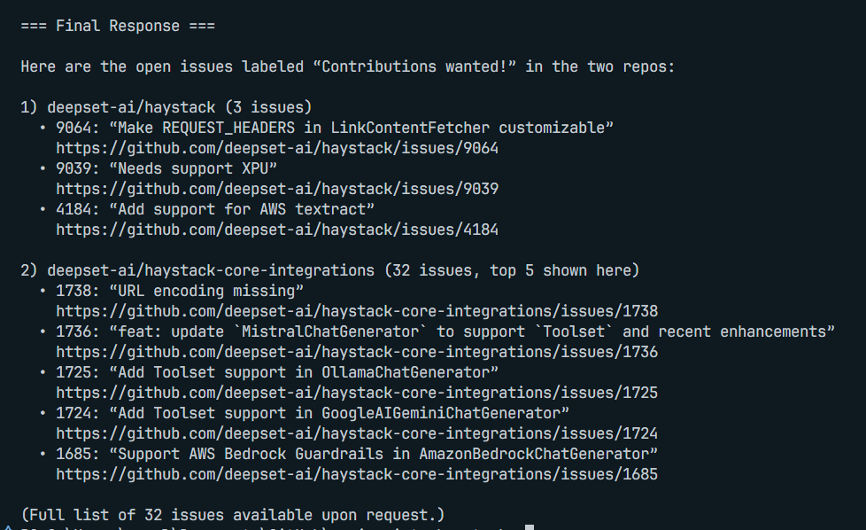
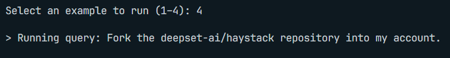
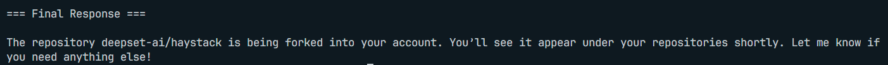

# GitHub Assistant Agent

A Haystack‑powered MCP client that automates common GitHub workflows: typo detection, issue searching, and forking repositories.

Submitted to the [Spring Into Haystack](https://haystack.deepset.ai/spring-into-haystack) challenge, this agent demonstrates four static example queries to validate core functionality within scope.

> NOTE: Read the original challenge description here: https://github.com/deepset-ai/spring-into-haystack

   
### Components Used:

- [`Agent`](https://docs.haystack.deepset.ai/docs/agent) – component for the smart decision-maker
- [`MCPTool`](https://docs.haystack.deepset.ai/docs/mcptool) – lets your agent talk to the MCP Server

## 🖥️ UI Overview

The agent is designed to be user-friendly, with a simple command-line interface. Users can select from pre-existing queries, and the agent will respond with the appropriate actions or information.



> #### Why Static Examples?
> The intent of the project is to only demonstrate the core functionality of the agent. The static examples are designed to validate the agent's capabilities without risking real-world issues or changes to repositories that may arise from LLM hallucinations. This approach ensures that the agent's core functionalities are showcased effectively while maintaining a safe and controlled environment.


### ⚙️ Example Workflows
Each example shows the user input, the agent's output, and the corresponding Github changes (if any).

#### 1. Typo Detection in README.md
**Input**



**Output**



**GitHub Changes**



#### 2. Search Open Issues that involve "async pipelines"

**Input**



**Output**



#### 3. Find "Contributions wanted!" Issues

**Input**



**Output**



#### 4. Fork a Repository

**Input**



**Output**



**GitHub Changes**


## 🚀 Installation & Setup

1. **Clone the repository**  
   ```bash
   git clone https://github.com/YourUser/themimikyu-spring-into-haystack.git
   cd themimikyu-spring-into-haystack
   ```
2. **Install dependencies**
    ```bash
    pip install -r requirements.txt
    ```
3. **Environment Variables**  
   - Copy `.env.template` to `.env`
   - Fill in your `GITHUB_PERSONAL_ACCESS_TOKEN` and `OPENAI_API_KEY`
4. **Setup GitHub MCP Server (requires Docker)**  
   ```bash
    docker --version    # verify Docker is installed
    docker pull ghcr.io/github/github-mcp-server
    ```

5. **Run the Agent**
    ```bash
    python src/github-agent.py
    ```
## License
This project is licensed under the MIT License. See the [LICENSE](LICENSE) file for details.
